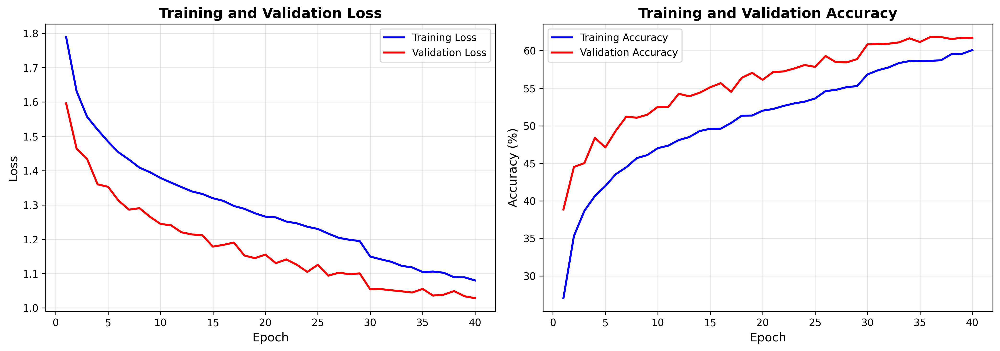
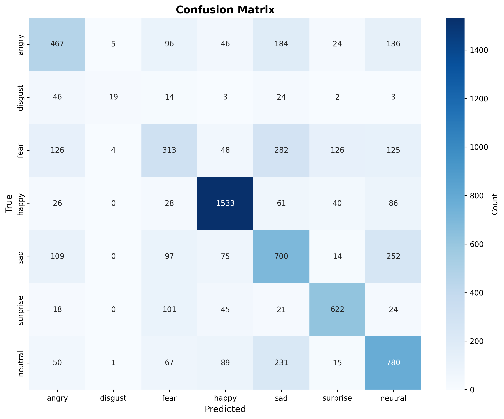

# Facial Expression Recognition 🎭

[](https://www.python.org/)
[](https://pytorch.org/)
[](https://www.docker.com/)
[](LICENSE)
[]()

> A containerized deep learning system for real-time emotion detection from facial expressions

## 📌 Overview

This project implements a CNN-based emotion classifier trained on FER-2013 dataset, achieving **61.8% accuracy** across 7 emotion classes. Built as part of the Technologies IA course (3A-SDD 2025-2026), it demonstrates modern MLOps practices with full Docker containerization.

**Key Features:**
- Custom CNN architecture (2.5M parameters) 
- Docker-based reproducible training pipeline
- REST API for inference
- Real-time webcam detection
- Complete visualization suite

## 🎯 Quick Start

### Prerequisites
- Docker Desktop + WSL2 (Windows) or Docker Engine (Linux)
- 16GB RAM recommended
- 2GB free disk space

### 1. Get the Dataset
Download [FER-2013 from Kaggle](https://www.kaggle.com/datasets/msambare/fer2013) and organize as:
```
data/
├── train/
│   ├── angry/
│   ├── disgust/
│   ├── fear/
│   ├── happy/
│   ├── sad/
│   ├── surprise/
│   └── neutral/
├── val/
└── test/
```

### 2. Train the Model
```bash
# Build and train in one command
docker-compose up training

# Monitor progress
docker logs -f emotion-training
```
**Training time:** ~60-70 minutes on CPU (Intel i5-1145G7)

### 3. Deploy the API
```bash
# Start the API server
docker-compose up api

# Test it
curl http://localhost:5000/health
```

### 4. Try the Webcam Demo (Local)
```bash
python test_webcam.py
```
Press `q` to quit.

## 📊 Results

| Metric | Value |
|--------|-------|
| **Test Accuracy** | 61.77% |
| **Best Val Accuracy** | 61.82% |
| **Training Time** | 66.3 min |
| **Model Size** | 9.4 MB |

**Per-Class Performance:**
- Happy: 86.4% recall ⭐
- Surprise: 74.9% recall
- Neutral: 63.3% recall
- Disgust: 17.1% recall (limited data)

<div align="center">
  
  
</div>

## 🏗️ Architecture

```
Input (48×48 grayscale)
    ↓
Conv2D(32) → BatchNorm → ReLU → MaxPool
    ↓
Conv2D(64) → BatchNorm → ReLU → MaxPool
    ↓
Conv2D(128) → BatchNorm → ReLU → MaxPool
    ↓
Flatten → Dense(512) → Dropout → Dense(7)
    ↓
Softmax (7 emotions)
```

## 🔧 API Usage

### Single Prediction
```bash
curl -X POST -F "file=@image.jpg" http://localhost:5000/predict
```

Response:
```json
{
  "emotion": "happy",
  "confidence": 0.87,
  "all_probabilities": {
    "angry": 0.01, "disgust": 0.01, "fear": 0.02,
    "happy": 0.87, "sad": 0.01, "surprise": 0.04, "neutral": 0.03
  }
}
```

### Batch Prediction
```python
import requests

files = [('files', open(img, 'rb')) for img in image_paths]
response = requests.post('http://localhost:5000/predict_batch', files=files)
```

## 📂 Project Structure

```
├── src/
│   ├── model.py      # CNN architecture
│   ├── dataset.py    # Data loading + augmentation
│   ├── train.py      # Training loop
│   └── utils.py      # Metrics & visualization
├── api.py            # Flask REST API
├── test_webcam.py    # Live demo
├── Dockerfile        # Container definition
├── docker-compose.yml
├── requirements.txt
└── results/          # Outputs: plots, metrics, model
```

## 🐳 Docker Commands

```bash
# Build only
docker-compose build

# Train in background
docker-compose up -d training

# View logs
docker logs -f emotion-training

# Stop all
docker-compose down

# Clean everything
docker-compose down -v
```

## 🔬 Technical Details

**Model Configuration:**
- Batch size: 32
- Learning rate: 0.0005 (Adam optimizer)
- Epochs: 40 (early stopping @ patience=7)
- Data augmentation: flip, rotation, brightness, affine transform
- Regularization: BatchNorm + Dropout (0.5, 0.3)

**Hardware:**
- CPU: Intel i5-1145G7 @ 2.60GHz
- RAM: 16GB DDR4
- Training speed: ~231 images/sec

## 🎓 Course Information

**Course:** Technologies IA: Conteneurisation et déploiement  
**Program:** 3A-SDD 2025-2026  
**Institution:** École Centrale Casablanca  
**Authors:** Yassine TAMIM, Zakaria LIMI

## 📄 License

Academic project  -